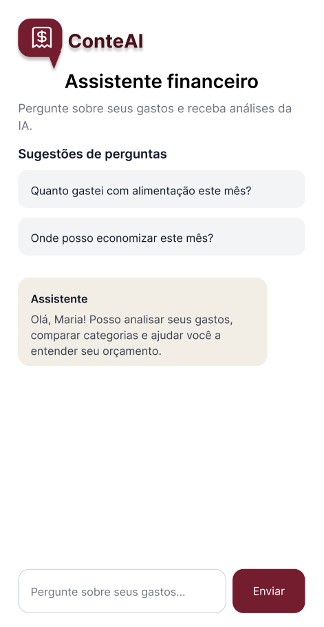
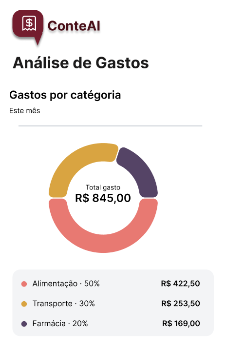

# ConteAI - Assistente Financeiro Inteligente

O **ConteAI** é uma aplicação financeira full-stack que simplifica o registro e a análise de despesas pessoais. Por meio de comandos de voz e linguagem natural, o usuário pode registrar seus gastos, acompanhar o histórico de transações, visualizar a distribuição das despesas por categoria e consultar um assistente financeiro com inteligência artificial.
A aplicação possui um frontend mobile-first desenvolvido com **Angular, TypeScript e SCSS**, integrado a uma API construída com **Java e Spring Boot**. A integração com a **OpenAI** permite interpretar informações financeiras fornecidas pelo usuário e gerar análises com base nas transações cadastradas.
O backend foi estruturado seguindo os princípios da **Clean Architecture** e do **SOLID**, mantendo as regras de negócio independentes das tecnologias externas e promovendo separação de responsabilidades, baixo acoplamento, testabilidade e facilidade de evolução.
Mais do que um controle de despesas, o ConteAI explora a aplicação prática de inteligência artificial em uma experiência financeira simples, acessível e visualmente consistente.


---

##  Funcionalidades e Showcase

### Captura de Despesas por Voz
Cansado da digitação manual. Basta clicar no botão de gravar e relatar seus gastos naturalmente. A IA converte seu áudio em texto, extrai os valores, categoriza a despesa (Mercado, Automóvel, Farmácia, etc.) e atualiza seu painel em tempo real.

<div align="center">
  
  
</div>

### Consultor Financeiro IA Integrado
Um consultor contextualizado com os seus dados. Faça perguntas sobre o seu orçamento, peça análises de gastos do mês ou simule cenários. A IA entende o contexto das suas finanças e devolve conselhos práticos e personalizados diretamente na sua tela.

<div align="center">
  
</div>

### Dashboard de Performance Premium
Acompanhe a saúde do seu negócio ou finanças pessoais através de uma interface minimalista estilo "Planner SaaS". Gráficos dinâmicos e tabelas atualizadas instantaneamente mostram a distribuição do seu capital e as últimas transações.

<div align="center">
  
</div>

---

##  Stack Tecnológico

A aplicação isola as regras de negócio de frameworks web e bancos de dados, garantindo máxima escalabilidade:

- **Interface (Client):** HTML5, CSS3 (Custom Properties & Flexbox), Vanilla JS, Chart.js.
- **Core & API:** Java 25, Spring Boot 3+.
- **Inteligência Artificial:** Spring AI (Integração com Whisper para transcrição, GPT para o consultor e TTS).
- **Persistência:** MySQL 9.6, Spring Data JPA, Hibernate.
- **Infraestrutura:** Docker (Spring Boot Docker Compose).

---

### Quick Start

O ambiente de banco de dados é orquestrado de forma transparente via Docker Compose, integrado nativamente ao Spring Boot.

**1. Configure a sua Chave da OpenAI**
No arquivo `src/main/resources/application.properties`, insira sua chave (ou configure via variável de ambiente na sua IDE):

```properties
spring.ai.openai.api-key=SUA_CHAVE_AQUI
```

**2. Inicie os Containers**
Certifique-se de que o **Docker Desktop** está em execução na sua máquina.

**3. Rode a Aplicação**
Execute o comando abaixo na raiz do projeto (a imagem do MySQL será baixada e instanciada automaticamente):

```bash
./gradlew bootRun
```

**4. Acesse o Painel**
A interface completa e os endpoints estarão disponíveis em:  
👉 **http://localhost:8080**
